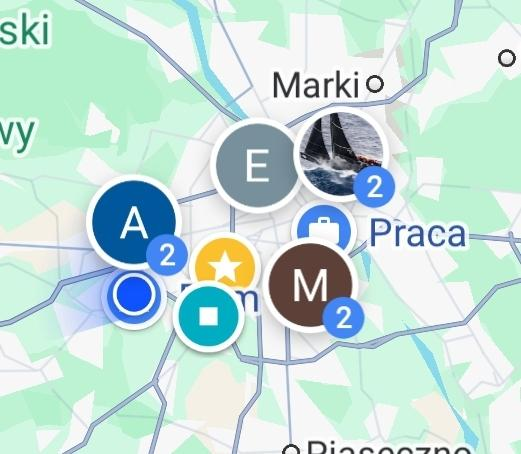
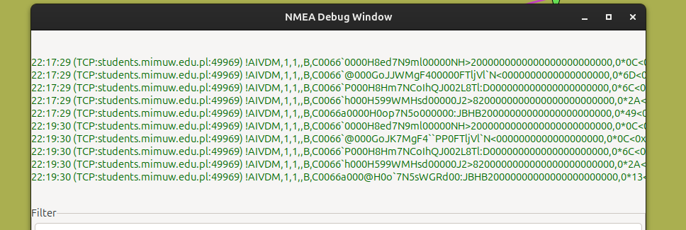
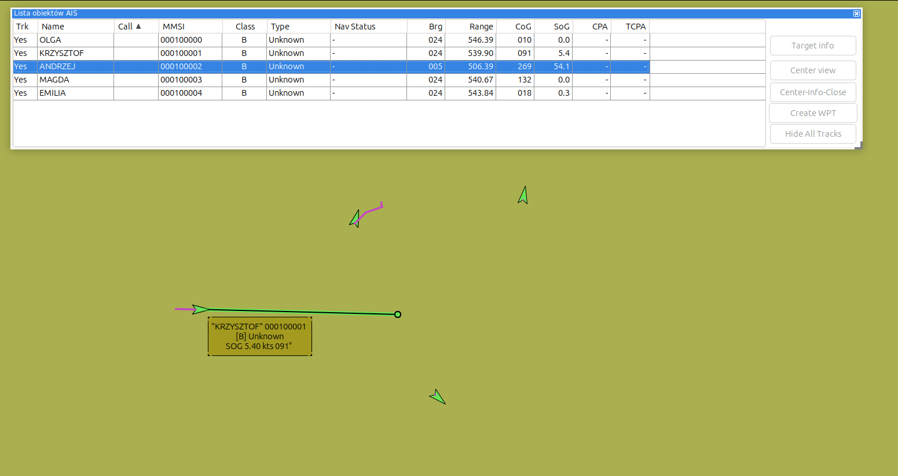
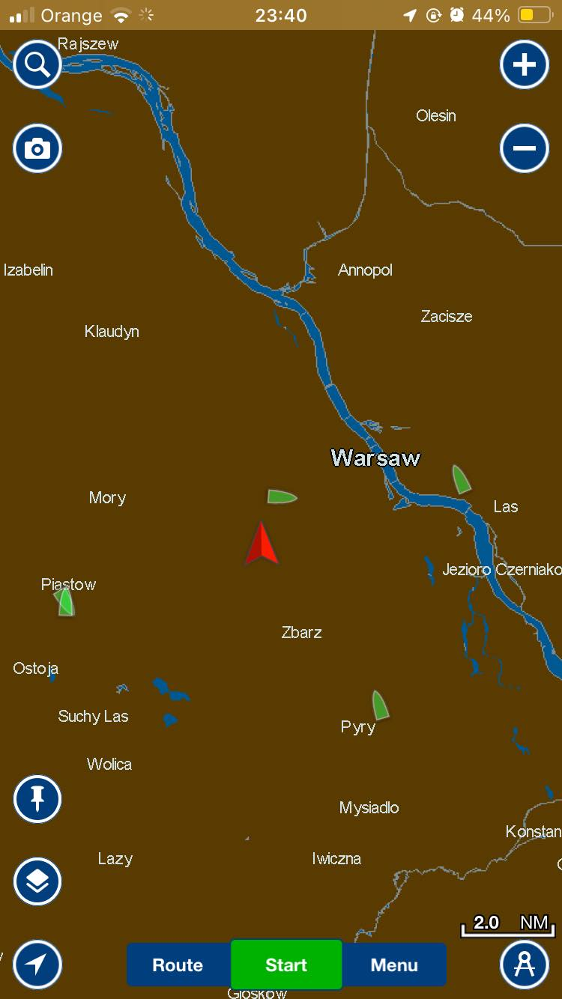

Example usage:

python3 prog.py --cookies_file cookies.txt | nc -u localhost 1234
python3 prog.py --cookies_file cookies.firefox-private.txt | nc -lk 49903

or if you configure extracting cookies from your browser:

python3 prog.py | nc -u localhost 1234

From this:

Through this:

To this:

And this:

